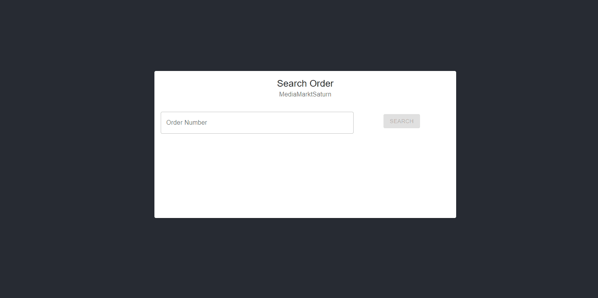

# NestJs GraphQL API

<!-- TABLE OF CONTENTS -->
## Table of Contents

- [Table of Contents](#table-of-contents)
- [About The Project](#about-the-project)
    - [Built With](#built-with)
- [Getting Started](#getting-started)
    - [Prerequisites](#prerequisites)
    - [Installation](#installation)
- [Usage](#usage)
    - [Server](#server)
    - [Client](#client)
- [License](#license)
- [Contact](#contact)

## About The Project

Example of an GraphQL API developed with NestJs and a React client application that fetches data from the server using
Apollo Client library.

### Built With

- [NestJs 8](https://nestjs.com/)
- [React 18](https://reactjs.org/)
- [GraphQL](https://graphql.org/)

## Getting Started

### Prerequisites

1. [NodeJs](https://nodejs.org/en/download/) 14 or above.
2. [Docker](https://docs.docker.com/get-docker/) in order to run database locally using docker-compose from this repository.

### Installation

1. Clone the repo
   ```sh
    git clone https://github.com/danicaliforrnia/mediamarktsaturn-nestjs-graphql 
   ```

2. Locate in the server folder

   ```sh
    cd mediamarktsaturn-nestjs-graphql/server
   ```
   
3. Install packages

   ```sh
    npm install
   ```
   
4. Copy .env.sample file, rename it to .env and fill it.

5. Run the following command to set up database container
   ```sh
    npm run docker:init
   ```
   
> Note: env variables are taken from .env file.

6. run migrations to create database tables   

   ```sh
    npm run migration:run
   ```
   
7. Locate in the client folder

   ```sh
    cd mediamarktsaturn-nestjs-graphql/client
   ```

8. Install packages

   ```sh
    npm install
   ```
   
9. Copy .env.sample file, rename it to .env.local and fill it.
 
## Usage

### Server

1. Locate in server folder
2. Run
   ```sh
    npm run start
   ```
    or 
   ```sh
    npm run start:dev
   ```
   
This application use the `code-first` approach in which the GraphQL schema is created when
the server starts based on the typescript classes and interfaces defined with the proper
decorators.

### Client

1. Locate in client folder
2. Run
   ```sh
    npm run start
   ```
   


## License

Distributed under the MIT License.

## Contact

Daniel Stefanelli - [Repositories](https://github.com/danicaliforrnia) - [LinkedIn](https://www.linkedin.com/in/daniel-stefanelli/)
